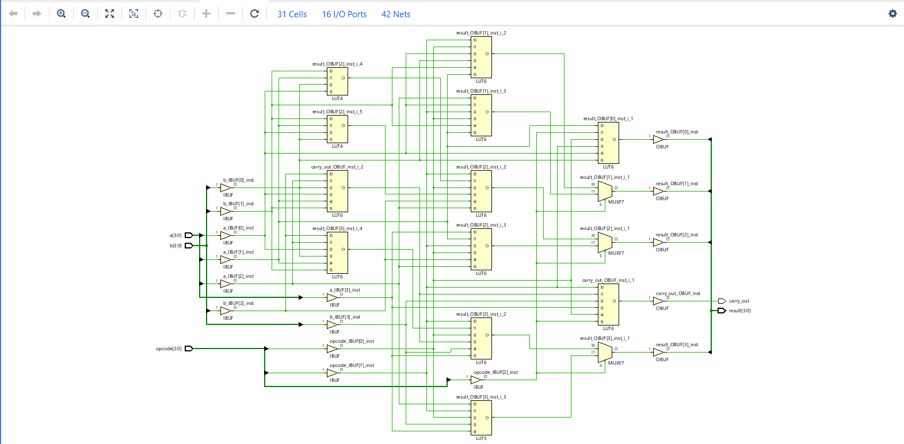
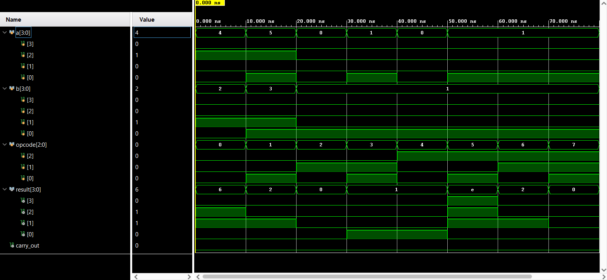

# 4-Bit Arithmetic Logic Unit (ALU)

## Overview
This project implements a 4-bit ALU capable of performing standard arithmetic and logical operations. It demonstrates the use of parameterized datapaths and `case` statements in Verilog to route different operations based on an opcode input.

## Directory Structure
* `src/` - Contains the core Verilog ALU design module.
* `sim/` - Contains the testbench to verify all opcode instructions.
* `images/` - Contains simulation waveform screenshots.

## Simulation & Verification
The ALU operations and datapath routing were fully verified using **Xilinx Vivado Behavioral Simulation**. 

## Operations Supported
* Addition / Subtraction
* Bitwise AND, OR, XOR
* Logical Shifts (if applicable)