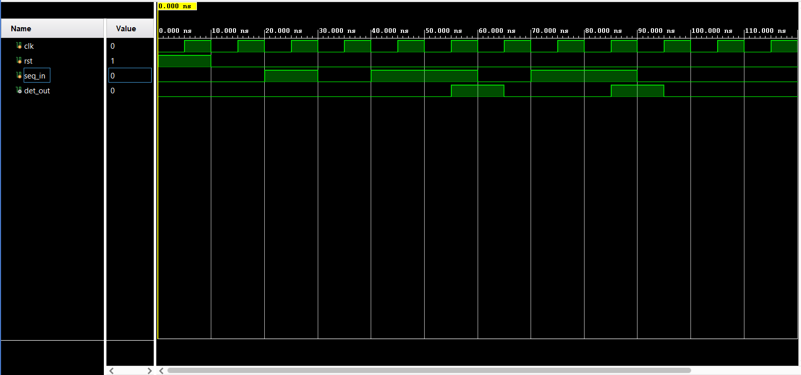
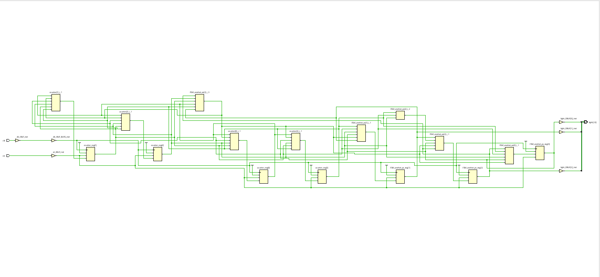
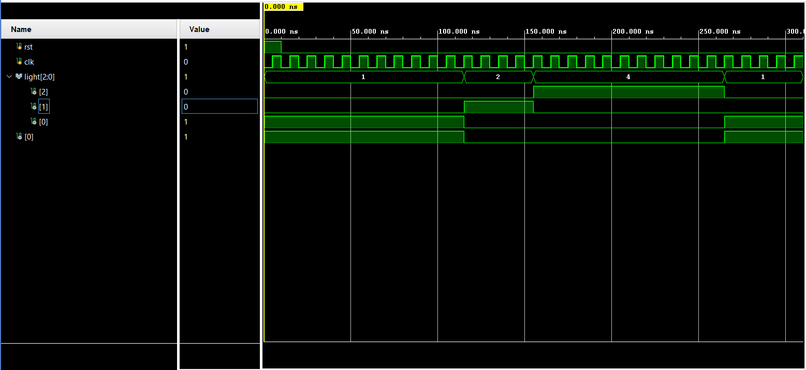

# 4: Finite State Machines (RTL Design)

This folder contains the RTL logic, testbenches, and simulation data for synchronous Finite State Machine (FSM) projects developed in Verilog HDL. 

---

## Project 1: 1011 Overlapping Sequence Detector 

### Overview
A synchronous FSM engineered to detect the sequence `1011` in a continuous serial input stream. The design successfully accounts for overlapping sequences (e.g., an input of `1011011` triggers the output high twice without dropping bits).

### Technical Specifications
* **Architecture:** 5-State Moore/Mealy FSM (S0, S1, S2, S3, S4)
* **Tools Used:** Xilinx Vivado (Synthesis & Behavioral Simulation)
* **Key Features:**
  * Synchronous active-high reset.
  * Overlapping sequence detection logic (Loops from S4 back to S2 on a `0` input).
  * Clean separation of Sequential (memory) and Combinational (state transition) logic blocks.

### Simulation & Verification
The design was verified using a custom testbench (`seq_detector_tb.v`) applying a 10ns clock cycle. The stimulus tests both the standard sequence and overlapping edge cases to ensure state memory holds correctly.

---

## Project 2: Traffic Light Controller FSM

### Overview
RTL design for a standard 3-state Traffic Light Controller (Red, Yellow, Green). It demonstrates timer-based state transitions, synchronous output control, and real-world intersection logic.

### Technical Specifications
* **Architecture:** 3-State FSM 
* **Tools Used:** Xilinx Vivado (Synthesis & Behavioral Simulation)

---
### How to Run These Projects
1. Clone this repository.
2. Open Xilinx Vivado and create a new project.
3. Add the respective `.v` design source and `tb.v` simulation source files.
4. Run **Behavioral Simulation** to view the generated waveforms.